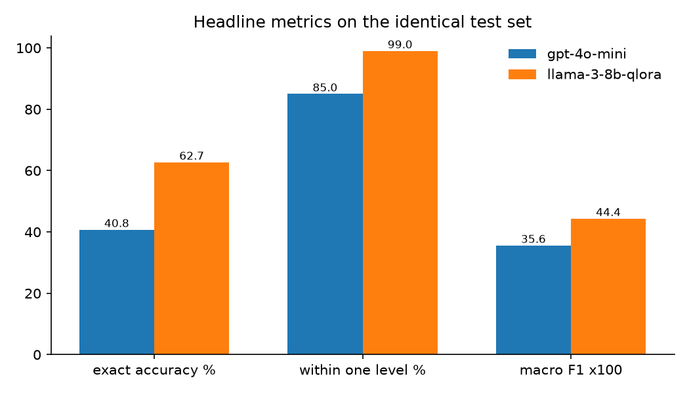
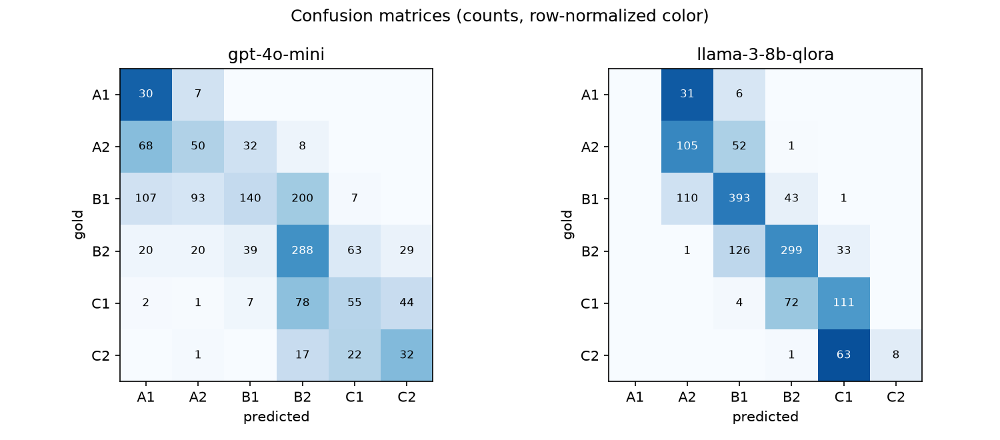
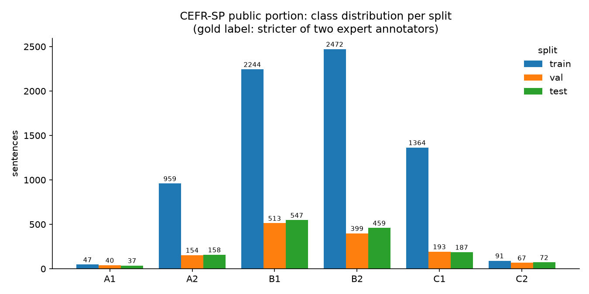

# CEFR QLoRA Benchmark

Can a QLoRA fine-tuned Llama 3 8B classify the CEFR difficulty of English
sentences better and cheaper than GPT-4o-mini? **Yes: 62.7% accuracy vs
40.8%, at 24x lower cost per request and 3x lower latency.**

[](https://huggingface.co/akallam04/Llama-3-8B-cefr-qlora)
[](LICENSE)

## Why

My [LLM Feedback API](https://github.com/akallam04/LLM-Multilingual-Feedback-API)
calls GPT-4o-mini to estimate the CEFR level (A1 to C2) of learner-written
sentences. Every call costs money and a round trip. This project asks the
production question: does a small open-source model, fine-tuned with QLoRA
for a few GPU-hours, beat that API call on accuracy, latency, and cost?

## Results

Both models classify the **identical** held-out test set (n=1,460), proven
byte-identical by a SHA-256 checksum embedded in every prediction file.

| Metric | GPT-4o-mini few-shot | Llama 3 8B QLoRA |
|---|---|---|
| Exact accuracy | 40.75% | **62.74%** |
| Within one level | 85.0% | **99.04%** |
| Macro F1 | 0.356 | **0.4435** |
| Quadratic weighted kappa | 0.6479 | **0.8076** |
| Mean absolute error (levels) | 0.761 | **0.382** |
| Latency, single request (mean) | 0.583 s | **0.187 s** |
| Cost per 1,000 requests | $0.1304 | **$0.0055** |
| Parse failures | 0 | 0 (by construction) |





- Exact McNemar test on paired correctness: 526 sentences only the
  fine-tune got right vs 205 only the baseline, p = 2.3e-33.
- Context for the accuracy numbers: the two expert annotators behind this
  dataset agree with each other exactly only **41.4%** of the time (100%
  within one level). Few-shot GPT-4o-mini sits at that human-agreement
  band; the fine-tune surpasses it because it learned this dataset's
  specific strict-annotator rubric from 7,177 examples.
- 99% within-one-level means the fine-tune fully internalized the ordinal
  structure: when it misses, it misses by a single level.

### Cost: measured, not estimated

- GPT-4o-mini: 1,257,886 input + 2,920 output tokens returned by the API
  across 1,460 calls, at $0.15/$0.60 per 1M (verified 2026-07-05).
- Fine-tune: 35.15 sentences/s measured at batch 32 on an NVIDIA L4 at
  $0.70/h on-demand (GCP, checked 2026-07-05), assuming full utilization.
- Break-even: one L4-hour serves ~126k sentences, which would cost ~$16.50
  on the API. Self-hosting wins above roughly 4% sustained GPU utilization
  (about 1.5 requests/s); below that, the API is cheaper.

## The hard part: 47 training sentences for an entire class



CEFR data is always thin at the extremes: the train split has 47 A1 and 91
C2 sentences against thousands mid-scale, and the test set is
proportionally 3 to 4 times richer at the extremes. Macro F1 weights all
six classes equally, so the benchmark is won or lost at the edges.

The fine-tune's one weakness lives exactly there: it **never predicts A1**
(F1 0.00) and rarely C2 (F1 0.20), collapsing extremes into their
neighbors, while beating the baseline everywhere else:

| Class F1 (test) | A1 | A2 | B1 | B2 | C1 | C2 |
|---|---|---|---|---|---|---|
| GPT-4o-mini | **0.23** | 0.30 | 0.37 | 0.55 | 0.33 | **0.36** |
| QLoRA | 0.00 | **0.52** | **0.70** | **0.68** | **0.56** | 0.20 |

### Ablation: does oversampling fix the extremes? No.

The standard remedy is to duplicate rare-class training rows. I reran the
identical recipe with A1 and C2 oversampled to 500 rows each (train grew
7,177 to 8,039; nothing else changed):

| Test metric | base recipe | + oversampling |
|---|---|---|
| Exact accuracy | 62.74% | 64.11% |
| Macro F1 | 0.4435 | 0.4489 |
| A1 F1 | 0.00 | 0.00 |
| C2 F1 | 0.20 | 0.18 |
| McNemar vs base | | p = 0.09 (not significant) |

A1 stayed at exactly zero. Duplicating 47 unique sentences ten times adds
signal strength but no new information, so the class boundary never forms.
The honest fix is new unique A1/C2 data, listed under future work. The
final model remains the base recipe, selected by validation macro F1
(0.5132 vs 0.5023); choosing by test scores would leak the test set into
model selection.

## How it works

**Data pipeline** ([src/prepare_data.py](src/prepare_data.py)). Downloads
the public portion of [CEFR-SP](https://github.com/yukiar/CEFR-SP)
(Wiki-Auto CC BY-SA 3.0, SCoRE CC BY-NC-SA 4.0) pinned to an exact
upstream commit, audits the official splits (zero cross-split leakage, one
duplicate in 10,004 rows), and verifies every raw and processed byte
against a committed checksum manifest. Every disagreement between the two
expert annotators is exactly one level, so the gold label takes the
stricter annotator (a sentence is as hard as the stricter expert says),
which also preserves C2 at 230 examples instead of 33.

**Baseline** ([src/baseline_gpt4o_mini.py](src/baseline_gpt4o_mini.py)).
A deliberately strong opponent: 18 expert-agreed exemplars (3 per level,
both subcorpora), a strict-examiner calibration block, temperature 0, and
measured per-request latency and token usage. The prompt was tuned on
validation samples only (two documented iterations, 35.5% to 37.0%) and
frozen before the single test pass.

**Fine-tune** ([notebook](notebooks/finetune_qlora_colab.ipynb) /
[script](src/finetune_qlora.py)). Llama 3 8B in 4-bit NF4, LoRA r=16 on
all seven attention and MLP projections (0.9% trainable), completion-only
loss on a **single bare-digit label token**. That design makes inference
one forward pass and an argmax over exactly six token logits: no
generation, no parsing, zero parse failures by construction. Three epochs,
47 minutes on an L4. Epoch checkpoints are scored on validation macro F1
and the best one ships; notably the winning epoch had the *worst*
validation loss (cross-entropy measures calibration, argmax accuracy does
not).

**Evaluation** ([src/evaluate.py](src/evaluate.py)). Refuses to compare
prediction files unless their dataset checksums and gold labels match
row-by-row, recomputes every metric from raw predictions, and runs an
exact McNemar test on paired correctness.

## Reproduce

```bash
git clone https://github.com/akallam04/cefr-qlora-benchmark.git
cd cefr-qlora-benchmark
python3 -m venv .venv && .venv/bin/pip install -r requirements.txt
cp .env.example .env                      # add your keys
.venv/bin/python scripts/preflight.py     # verifies all credentials
.venv/bin/python src/prepare_data.py      # deterministic, checksum-verified
.venv/bin/python src/baseline_gpt4o_mini.py --split test   # ~$0.19
```

Training runs on a CUDA GPU (Colab L4: ~47 min): open
[notebooks/finetune_qlora_colab.ipynb](notebooks/finetune_qlora_colab.ipynb)
in Colab, or on any GPU box:

```bash
python src/finetune_qlora.py --output-dir qlora-out
python src/select_and_predict.py --checkpoints-dir qlora-out --upload
.venv/bin/python src/evaluate.py          # table, charts, McNemar
```

## Repo structure

```
src/
  prepare_data.py        data pipeline with checksum manifest
  baseline_gpt4o_mini.py few-shot baseline, latency + cost accounting
  finetune_qlora.py      QLoRA training (script twin of the notebook)
  select_and_predict.py  best-epoch selection, prediction, Hub upload
  predict_finetuned.py   single-adapter prediction
  evaluate.py            comparison harness with dataset identity guard
  utils.py               shared prompt format, label maps, io
notebooks/               Colab notebook with self-verifying safety cells
results/                 predictions, metrics, figures (committed evidence)
data/                    gitignored, rebuilt deterministically
```

## Limitations

- Both extremes remain hard: 47 A1 training sentences cannot define a
  class boundary, and oversampling provably did not help. New unique
  A1/C2 data (other corpora, augmentation) is the real fix.
- Gold labels follow the stricter of two annotators; scores are not
  comparable to papers using both labels with soft-label training.
- The cost advantage assumes a rented L4 near full utilization; below
  ~4% utilization the API wins, and OpenAI's batch API halves its price.
- Single dataset, English only, pre-tokenized text (spaces before
  punctuation) kept as-is for provenance.
- A chain-of-thought GPT baseline was deliberately excluded: it would
  multiply latency and output cost, and the production target is a cheap
  terse classifier. It would likely narrow the accuracy gap.

## Licenses and acknowledgments

Code is MIT. The dataset is the public portion of
[CEFR-SP](https://github.com/yukiar/CEFR-SP) (Arase, Uchida, and Kajiwara,
*CEFR-Based Sentence Difficulty Annotation and Assessment*, EMNLP 2022):
Wiki-Auto portion CC BY-SA 3.0, SCoRE portion CC BY-NC-SA 4.0, so treat
the trained adapter as non-commercial research use. The fine-tune is
*Built with Meta Llama 3* under the Meta Llama 3 Community License.
QLoRA method: Dettmers et al., 2023. Experiment tracking:
[Weights & Biases](https://wandb.ai/akallam04-arizona-state-university/cefr-qlora-benchmark).
